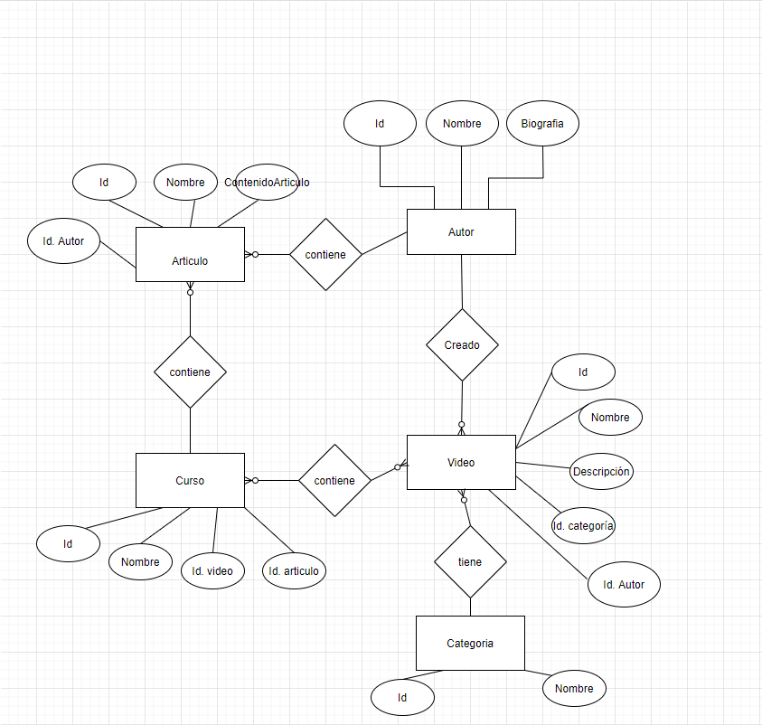

# Modelado de Base de Datos Relacional
## _La muerte acida de lemonCode_

Para esta práctica se nos solicita:

- Diagrama del modelo de datos.
- Markdown con explicación de por qué se ha realizado dicho modelado, patrones aplicados y razón.

## Introducción

> Para este trabajo se ha requerido una plataforma de videos de formación, en la cual al darte de alta como alumno accedes a  los videos de la plataforma. Portal orientado al mundo de la programación.

## Consideraciones

> El portal va a estar compuesto por cursos, cada curso está compuesto a su vez por un número de videos y artículos que lo acompañen.

> La página de cursos debe mostrar la lista de autores que lo hicieron.
> La página de un video debe mostrar el autor que lo realizó.
> Los videos se pueden clasificar por temáticas (Devops / Front End / Back End / ...)
> Los videos tienen autores (ponemos la restricción, un video tiene un autor), un curso puede tener varios autores.
> En principio los vídeos no se van a compartir entre diferentes cursos (aunque sería una amplicacíon interesante del ejercicio). Nosotros lo haremos con la ampliazión.
> Hay una opción para ver la página con la biografía del autor. 

## Parte Obligatoria

>Generar el modelo de entidad relación.

## Documentos Entregables

    - ✅ Markdown.
    - ✅ Diagrama E/R de Chen.
    - ✅ Modelado SQL en drow.io

# Diagramas E/R (Entidad/Relacion).
## Diagrama de Chen

> Para el diagrama de Chen, hemos tenido en cuenta las consideraciones arriba descritas.

## Diagrama de Crow's Foot (Pata de gallo).

> Para el diagrama de pata de gallo, hemos consisderado, además de lo ya tenido en cuenta en el diagrama de Chen, la entidad Alumno y Dirección con lo que ello conlleva en sus relaciones.

### Formas Normales
Para esta práctica hemos intentado aplicar dos "Formas Normales". Con el fin de seguir unas normas y mantener una integrigas referencial. De las 6, aplicaremos las 2 primeras.

| Patron | Descripcion | Ejemplo |
| ------ | ------ | ------ |
| 1NF | Valores Atómicos | Cada campo de una entidad es de un tipo.  |
| 2NF | Todos los campor dependen SOLO de la PK | rompemos entidades para evitar duplicidades |
| 3NF | Ningun atributo es dependiente transitivamente  | lo vemos en la direccion, evitamos la duplicidad y creamos tablas para provincia....etc |

